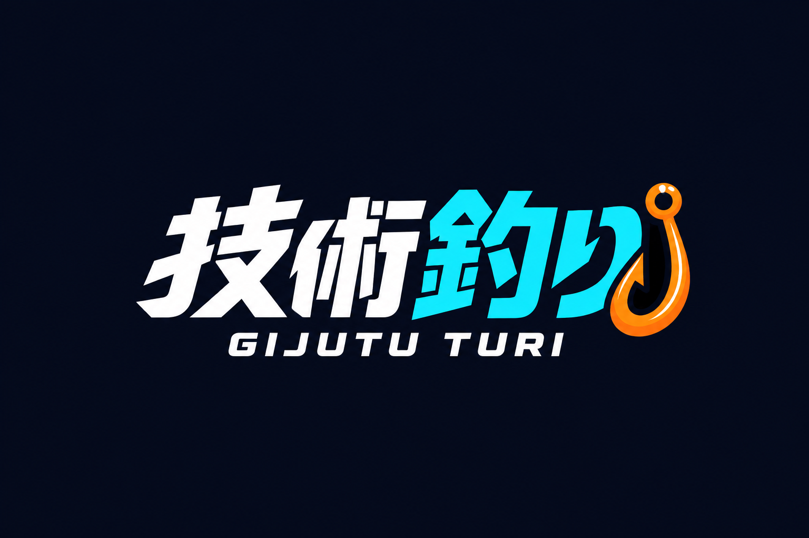

# 技術釣り / GIJUTU TURI



技術の性質を、魚の生態と釣り上げるときの抵抗として体験するWeb釣りゲーム。

## 今回のプレビュー

まずは「魚や説明がなくても眺めていたい海」と「目の前の海へ投げた感覚」を作る段階です。

- 画面いっぱいの3D海面、空の反射、緩やかな波。カメラは水中に入りません。
- 押してためる → ルアーの飛行 → 着水・波紋 → 巻き戻し。
- PC画面とコントローラー画面をWebSocketで同期。実際の接続に合わせて状態を表示します。
- スマホのモーション入力と、センサーを使えない場合のタッチ操作。
- あそびかた・図鑑は必要なときだけ開くダイアログ。「景色だけを見る」で操作表示を隠せます。
- 音は明示的にオンにした場合だけ再生。PWA用manifestと静的アセットキャッシュを用意しています。

**新画面は海とキャストのプレビューです。魚とのファイト、捕獲、図鑑への記録はまだ接続していません。**
Go魚は、釣り上げたときに初めて全身と「Go魚」の名前をはっきり見せる方針です。
旧試作の画面は整理し、現行の海UIとOcean用バックエンドを本体として扱います。

## 起動

### Go魚のモデル確認

サーバー起動後、[Go魚の3Dプレビュー](http://127.0.0.1:8787/go-fish.html)で形状を確認できます。
ドラッグで回転、スクロールで拡大。全身・真横・正面・ディテールの切り替え、一時停止、1→7匹の分岐表示に対応しています。
本編の海には未獲得の魚を表示しません。造形の参照先と実装範囲は [docs/go-fish-design.md](./docs/go-fish-design.md) に記録しています。

### 海とサーバー

Node.jsとnpmが必要です。

```powershell
npm install
npm run dev
```

[http://127.0.0.1:8787/](http://127.0.0.1:8787/) を開きます。
静的ファイルとAPIを同じサーバーから提供するため、HTMLの直接起動や静的サーバーだけでは操作できません。

## 操作

- PC: 「ここで投げてみる」またはSpaceを押してため、離して投げます。マウスの位置で左右の狙いを変えます。
- 着水後: 「巻き戻す」またはSpaceでもう一度投げられる状態に戻します。
- 「スマホで釣る」: 同じ海を操作するURLを表示。ローカルでは「別タブでコントローラーを試す」で動作を確認できます。
- 右上: 音の切り替え / 景色だけを見る。景色のみの表示からは画面の復帰ボタンかEscapeで戻せます。

初期設定は **127.0.0.1限定** です。別のスマホからlocalhostには接続できません。
実機のモーション入力には、両端末からアクセスできるHTTPS環境とセンサー許可が必要です。
外部公開、HTTPSデプロイ、スマホ実機での感度調整は今回の確認範囲外です。
オフラインでは海の表示用アセットを利用できますが、キャスト同期にはサーバー接続が必要です。

## 検証

```powershell
npm run typecheck
npm test
# サーバー起動中に別のターミナルから実行
npm run test:ocean
npm run test:fish
```

`test:ocean` は公開アセット、非公開パス、コントローラー接続、キャスト・着水・巻き戻し、連打・不正入力、切断時の状態を検証します。

## 主な構成

- `index.html` / `ocean.css`: 海とコントローラーのUI
- `ocean-scene.js`: Three.jsの海面・ルアー・糸・着水表現
- `ocean-app.js`: 操作、モーション入力、接続、音
- `src/ocean-room.ts`: キャスト体験専用のサーバー状態管理
- `src/ocean-game.ts` / `src/ocean-room.ts`: 海の釣り状態機械とWebSocketルーム
- `vendor/`: Three.js配布ファイルとライセンス

キャスト用ルームは最大128個、1ルーム8接続、無人になって30分後に回収されます。
ルームのURLは、その海を操作できる共有リンクです。第三者へ公開しないでください。
