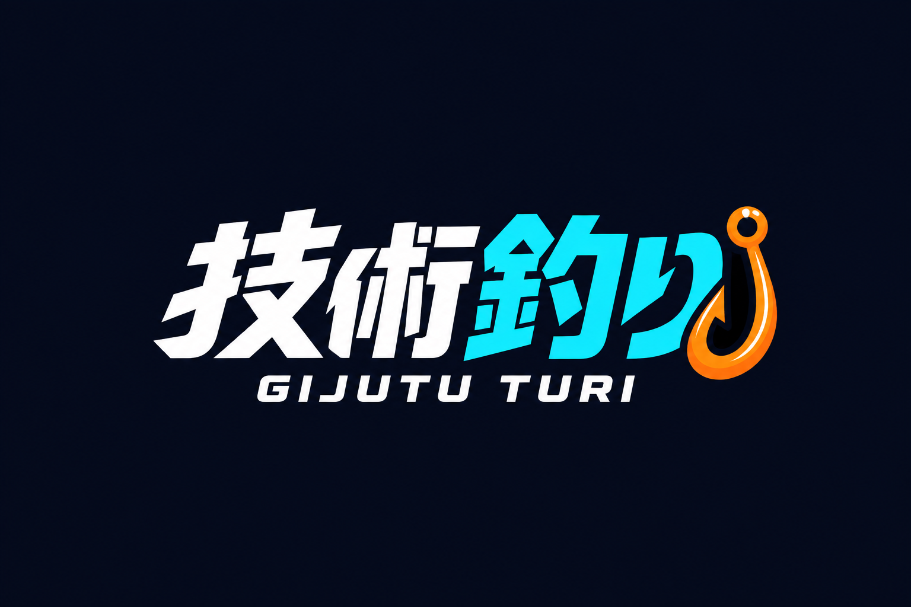

# 技術釣り — GIJUTU TURI



**技術の違いを、魚の引きとして体験するWeb釣りゲームです。**

PCに広がる海へキャストし、スマートフォンを釣り竿のコントローラーとしてつないで遊べます。Go、Docker、CSS、Kubernetesの考え方を、それぞれ異なる魚の動きや見た目に置き換えています。

[ローカルで遊ぶ](#はじめる) · [魚と技術の対応を見る](#魚と技術の対応) · [仕組みを見る](#アーキテクチャ)

## 何を目指しているか

プログラミングの概念を説明文だけで覚えるのではなく、操作したときの反応を通して感じられる作品を目指しています。投げる、合わせる、巻くという一連の操作に、魚の抵抗・竿の曲がり・糸の張り・水面の反応をつなげ、「技術ごとの性質」を遊びの手触りにするのが制作意図です。

魚の挙動は技術概念を伝えるための表現であり、GoやDocker、Kubernetesの内部動作をそのまま再現するシミュレーターではありません。

## 遊びの概要

1. ボタンを押してキャストの強さをため、海へ投げる。
2. ウキが沈んだらタイミングを合わせて魚を掛ける。
3. 魚の抵抗と糸の張りを見ながら、巻く・待つを切り替える。
4. 釣果は図鑑に記録され、魚種ごとの特徴を見返せる。

ゲーム画面はThree.jsで描く海と魚を中心に、操作UIは必要な場面だけ表示します。PC単体でも遊べますが、QRコードでスマートフォンを接続すると、振って投げる・回して巻く・画面上で操作する釣り体験になります。

## 魚と技術の対応

| 魚 | 表現する考え方 | ゲーム内の特徴 |
| --- | --- | --- |
| Go魚 | 並行処理 | 一匹から群れへ分かれ、複数方向から同時に引く |
| Dockerクジラ | コンテナと実行環境 | 掛かった直後に重く引き、慣性を残してゆっくり動く |
| CSS fish | 構造と見た目の分離 | 魚の形は保ったまま、状態に応じて色・模様・発光が変わる |
| K8sレヴィアタン | クラスターとレプリカ | 本体一匹に二つの表示上の影が追従する。影は別の釣果として数えない |

通常ルート `/` では、K8s以外のアクティブ魚種（Go魚・Dockerクジラ・CSS fish・Rustカジキ・JSアナゴ）から抽選します。K8sレヴィアタンは通常抽選に含まれず、専用URLから遊べます。捕獲後はGo魚→Dockerクジラ→Rustカジキ→JSアナゴ→Go魚の順に進み、CSS fishを釣った後はGo魚へ進みます。魚種別URLでは、釣り直してもその魚種に固定されます。

## 技術構成

| 層 | 技術 | 役割 |
| --- | --- | --- |
| UI | React 19、TypeScript、Vite | 海画面・操作画面・スマートフォンコントローラー・図鑑 |
| 3D | Three.js、WebGL、GLSL | 海面、魚、竿、糸、波紋、航跡の描画 |
| サーバー | Node.js 22、Hono | HTTP API、静的ファイル配信、ゲームルーム管理 |
| リアルタイム通信 | WebSocket（`ws`） | PC画面とスマートフォン間の状態・操作同期 |
| 入力検証 | Zod | APIとWebSocketから届くデータの検証 |
| ゲーム状態 | `OceanFishingGame` | 魚の動き、張力、距離、捕獲・逃走をサーバー側で判定 |
| 図鑑 | ローカル: SQLite（`node:sqlite`） / Cloud Run: Cloudflare D1（任意） | 魚種マスタ、プレイヤー別捕獲数、捕獲イベントを保存 |
| 配信 | Docker、Cloud RunまたはVercel構成 | Docker/Cloud Runはアプリ一体型、Vercelは静的フロントエンド用 |

## アーキテクチャ

```text
PCブラウザー（React + Three.js） ── WebSocket ──┐
                                                 ├─ Node.js + Hono サーバー
スマートフォン（Reactコントローラー） ─ WebSocket ┘  ├─ Ocean Rooms（接続・入力・配信）
                                                    ├─ OceanFishingGame（20Hzのゲーム判定）
                                                    └─ 捕獲イベント ──► SQLite / D1
```

- **サーバーがゲーム状態の正**です。アタリ、魚の位置・抵抗、距離、捕獲・逃走はサーバー側で決めます。
- **クライアントは操作と表示を担当**します。ゲームスナップショットを受け取り、魚や竿を滑らかに補間して描きます。
- **スマートフォンは入力端末**です。PCと同じルームへ接続し、同時操作による競合を防ぎます。
- **図鑑は捕獲イベントから更新**します。捕獲記録はサーバーがDBへ一度だけ保存し、画面側は図鑑を読み直します。
- **K8sの水面演出も魚の表示状態に同期**します。急浮上の時刻・モード・距離を魚の補間とそろえ、頭や背中などの接触点と水面シェーダーで共有する波・波紋の式から飛沫や再入水を判定します。航跡は魚の速度や身体波に応じて変わります。これらは表示演出で、捕獲判定や魚の強さを変更しません。

## はじめる

### 必要なもの

- Node.js 22以降
- npm
- スマートフォン連携も試す場合は、同じWi-Fiにつながるスマートフォン

### インストールと起動

```powershell
npm ci
npm run dev
```

PCで [http://127.0.0.1:8788/](http://127.0.0.1:8788/) を開きます。`npm run dev` はフロントエンドとバックエンドをまとめて起動します。

| ポート | 用途 |
| --- | --- |
| `8788` | Vite開発サーバー。ブラウザーで開く画面 |
| `8787` | HTTP API、WebSocket、SQLiteを扱うバックエンド |

開発サーバーはLANからの接続を受け付けます。PCで `localhost` を開いている場合も、QRコードはPCのLANアドレスに置き換わるため、同じWi-Fiのスマートフォンから接続できます。PC側ファイアウォールで開発サーバーへの接続を許可してください。ローカルHTTPではタッチ操作を使えます。モーションセンサーを使うには、スマートフォンから到達できるHTTPS環境とブラウザーのセンサー許可が必要です。

### 3Dモデルの単体プレビュー

`npm run dev` 起動中に、Go魚は [http://127.0.0.1:8787/go-fish.html](http://127.0.0.1:8787/go-fish.html)、Dockerクジラは [http://127.0.0.1:8787/docker-whale.html](http://127.0.0.1:8787/docker-whale.html) で確認できます。Go魚プレビューはドラッグ回転、スクロール拡大、角度切替、一時停止、1〜7匹の群れ表示に対応しています。

### 魚種別URL

| URL | 開始する魚 | 備考 |
| --- | --- | --- |
| `/` | Go魚・Dockerクジラ・CSS fishから抽選 | 通常のゲーム入口 |
| `/gofish` | Go魚 | 魚種固定 |
| `/dockerwhale` | Dockerクジラ | 魚種固定 |
| `/cssfish` | CSS fish | 魚種固定 |
| `/rustfish` | Rustカジキ | 魚種固定 |
| `/jseel` | JSうなぎ | 魚種固定 |
| `/k8sfish` | K8sレヴィアタン | 魚種固定。通常抽選には含まれない |
| `/docker` | Dockerクジラ | `/dockerwhale` の互換URL |

以前の `?fish=go`、`?fish=docker`、`?fish=cssfish`、`?fish=k8s` や `/fish=...` 形式のURLも互換用に利用できます。新しく共有する場合は上表のURLを使ってください。PCで作ったルームと魚種はスマートフォンにも引き継がれます。

### 操作

| 操作 | PC | スマートフォン |
| --- | --- | --- |
| 投げる | 「投げる」を長押しして離す。`Space`キーでも操作可能。マウス位置で左右を狙う | 画面を操作。モーションセンサーが使える環境では振って投げる |
| 合わせる | ウキが沈んだら「合わせる」を押す | 画面の操作ボタンを押す |
| 巻く | 「巻く」を押している間。`R`キーでも操作可能 | 画面のリールを押す、または端末を回す |
| 竿を引く | — | 戦闘中に端末を引いて戻すか、竿アクションボタンを使う |

魚が走っているときは無理に巻かず、糸の張りを見ながら操作します。効果音は画面の音ボタンで有効にできます。

## 設定

環境変数はNode.jsまたはViteのプロセスへ渡します。`.env.example` は設定例であり、このリポジトリの `npm run dev` は `.env` を自動読込しません。

| 変数 | 用途 | 既定値・注意 |
| --- | --- | --- |
| `BACKEND_PORT` | `npm run dev` のバックエンドポート | `8787` |
| `VITE_PORT` | Vite開発サーバーのポート | `8788` |
| `PORT` | Nodeサーバーのポート | `8787`。Dockerfileでは`8080` |
| `HOST` | Nodeサーバーの待受アドレス | `npm run dev`で未指定なら`0.0.0.0`。LAN接続が不要なら`127.0.0.1`に限定可能 |
| `GIJUTU_DB_PATH` | D1 / PostgreSQL 未設定時のSQLite保存先 | `data/gijutu-turi.sqlite` |
| `CLOUDFLARE_ACCOUNT_ID` | D1を使うCloudflareアカウントID | D1利用時に設定 |
| `CLOUDFLARE_D1_DATABASE_ID` | D1データベースID | D1利用時に設定 |
| `CLOUDFLARE_API_TOKEN` | D1 APIトークン（D1 Read / Write） | D1利用時にSecret Manager等から設定 |
| `DATABASE_URL` | 任意のPostgreSQL接続URL | D1とは同時に設定しない |
| `VITE_BACKEND_URL` | Vercelフロントエンドから接続するバックエンドURL | Vercelのビルド環境に設定 |
| `VITE_PUBLIC_ORIGIN` | OGP/Twitterカードに埋め込む公開URLのOrigin | 本番ビルド時に設定。例: `https://example.com`（末尾スラッシュなし） |
| `FRONTEND_ORIGIN` | API/WebSocketで許可するフロントエンドOrigin | Cloud Run側に設定。複数はカンマ区切り |

ポートを変えて起動する例:

```powershell
$env:BACKEND_PORT='8791'
$env:VITE_PORT='8792'
npm run dev
```

## ビルド・検証

```powershell
npm run typecheck
npm test
npm run build
```

サーバーを起動した状態で実行する追加検証:

```powershell
# 別ターミナルで起動
npm run dev:server

# さらに別のターミナルで実行
npm run test:ocean
npm run test:fish
npm run test:whale
```

`npm test` はゲームルール、WebSocket契約、図鑑、魚の動き、竿・糸・水面表現を検証します。統合検証と魚モデル検証は起動済みバックエンドに接続します。GitHub Actionsでは型検査・テスト・ビルド・統合検証・Dockerイメージのビルドを実行します。ブラウザーの実WebGL表示や実機センサーの動作は、端末上での確認も必要です。

## 配信とデータの注意点

- `npm run build` はクライアントを `dist/client`、Node.jsサーバーを `dist` に出力します。本番相当のローカル起動は `npm start` です。
- Docker/Cloud RunではNodeサーバーが画面・API・WebSocketをまとめて配信します。Cloud Runでの公開URLにはポート番号を付けません。
- Vercel構成は静的フロントエンド用です。WebSocket/APIサーバーは別途用意し、Vercelの `VITE_BACKEND_URL` とバックエンドの `FRONTEND_ORIGIN` を設定します。
- ルーム状態はNodeプロセスのメモリ上にあります。Cloud Runの再起動やインスタンス切替で接続中のルームは失われます。
- Cloud Runは既定で `/tmp` のSQLiteを使うため、再起動後の図鑑データ保持は保証されません。Cloud Runで永続化する場合はCloudflare D1を選べます。設定は[Cloudflare D1永続化ガイド](./docs/cloudflare-d1-persistence.md)を参照してください。D1設定と `DATABASE_URL`（PostgreSQL）は同時に使えません。
- ルームは最大128個、1ルーム最大8接続で、スマートフォンの操作担当は1台です。無人のルームは30分後に回収します。QR/ルームURLを知っている人はその海へ接続できるため、公開場所へ不用意に共有しないでください。
- Service Workerは静的ファイルをキャッシュしますが、ゲーム進行や捕獲記録にはオンラインのバックエンド接続が必要です。

デプロイ方法やCloud Runの料金・WebSocket・SQLiteの詳しい制約は[低コスト構成ガイド](./docs/cloud-run-cheap.md)を参照してください。アーキテクチャの責務分担とデータフローは[技術構成メモ](./docs/technical-architecture.md)、魚の造形方針は[Go魚の設計メモ](./docs/go-fish-design.md)と[Dockerクジラの設計メモ](./docs/docker-whale-design.md)にまとめています。

## 主なファイル

- `src/client/App.tsx`: Reactのゲーム画面、コントローラー、図鑑UI
- `src/client/useOceanRuntime.ts`: 接続、入力、音、センサー、画面ライフサイクル
- `src/ocean-game.ts`: サーバー権威の釣り状態機械と魚種別の戦闘判定
- `src/ocean-room.ts`: WebSocketルーム、接続役割、入力キュー、状態配信
- `src/ocean-contract.ts` / `src/fish-contract.ts`: 通信DTOと魚の泳ぎデータ契約
- `src/fish-species.ts` / `src/fishing-routes.ts`: 魚種レジストリとURL解決
- `src/rendering/ocean-scene.ts`: Three.jsの海・魚・竿・糸・水面演出
- `src/rendering/k8s-surface-motion.ts` / `src/rendering/fish-water.ts`: K8s水面接触と共有波面計算
- `src/collection-db.ts` / `src/d1-collection-db.ts` / `src/postgres-collection-db.ts`: SQLite / D1 / PostgreSQL図鑑データ
- `vendor/`: 使用するThree.js配布ファイルとライセンス

## ライセンス

自作コードは[MIT License](./LICENSE)です。Three.js、React、Honoなど第三者コンポーネントのライセンスは[第三者ライセンス一覧](./THIRD-PARTY-NOTICES.txt)を参照してください。本番ビルドでは `/license.txt` と `/third-party-notices.txt` としても公開します。
